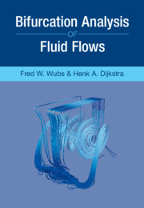

---
# Feel free to add content and custom Front Matter to this file.
# To modify the layout, see https://jekyllrb.com/docs/themes/#overriding-theme-defaults

layout: home
---

<table>
  <tbody>  
      <td> 
         </td>
      <td valign=top>These pages contain accompanying material and errata for the textbook <a href="https://www.cambridge.org/core/books/bifurcation-analysis-of-fluid-flows/4DD7DA62E5C0A3B8572D1615AA9CB0FC">Bifurcation Analysis of Fluid Flows </a> .</td>
  </tbody>
</table>

Software
--------

[TransiFlow](https://github.com/BIMAU/transiflow):  Python toolbox (formerly called FVM) used to generate the results in Chapter 10. It contains the discretization of the flow problems. For the solvers one can use either solvers that go with python, or use [HYMLS](https://github.com/nlesc-smcm/hymls) (based on [Trilinos](https://trilinos.github.io/)), or solvers from [PETSc](https://petsc.org/release/). 

[BifAnFF](https://github.com/BIMAU/BifAnFF): MATLAB/Octave program by which some results in Chapters 6,7, and 8 were obtained.

Errata
-------
So far none.

Hints/answers to selected exercises
--------------------
[3.6](ExercCh3/Exerc3_6.pdf)

Authors' contact information
-------------------
Prof.dr.ir. Henk A. Dijkstra  
Institute for Marine and Atmospheric research Utrecht
Department of Physics and Astronomy  
Utrecht University  
Princetonplein 5, 3584 CC Utrecht  
The Netherlands  
Phone: +31-30-2535441  
email: H.A.Dijkstra'at'uu.nl

Ass.Prof.Dr.ir. Fred W. Wubs   
Bernoulli Institute for Mathematics, Computer Science and Artificial Intelligence  
Faculty of Science and Engineering  
University of Groningen  
Nijenborgh 9, 9747 AG Groningen  
The Netherlands  
Phone: +31-50-3633994  
email: F.W.Wubs'at'rug.nl
